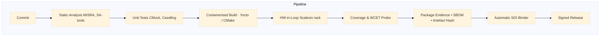
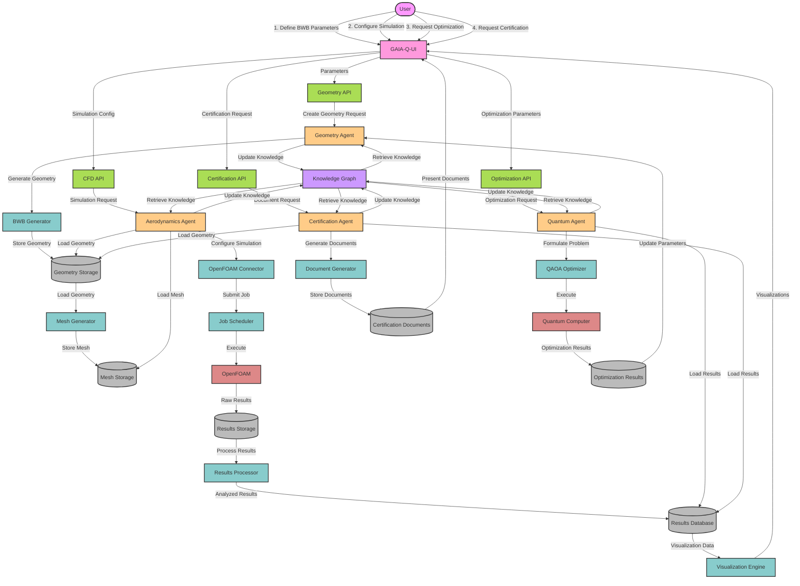

## Hi there 👋
# GAIA-QAO Quantum Aerospace Ecosystem

<p align="center">
  <a href="https://github.com/Gaia-Quantum-Aerospace-Venture">
    
  </a>
</p>

<p align="center">
  <a href="https://zenodo.org/badge/latestdoi/XXXXXXX"></a>
  <a href="#"></a>
  <a href="#"></a>
  <a href="#"></a>
  <a href="#"></a>
</p>

<div align="center">
  <h1>🌌 The Complete Quantum Aerospace Operating System</h1>
  <h3>SCL • MCP4U • Compliance Suite • Emergency Systems • Migration Tools</h3>
  <p><strong>Created by:</strong> Amedeo Pelliccia | <strong>Version:</strong> 1.0.0 | <strong>Date:</strong> 2025-01-20</p>
</div>

---

## 🎯 What is GAIA-QAO?

**GAIA-QAO** (Quantum Aerospace Organization) represents the world's first complete quantum-enhanced aerospace ecosystem. It provides:

- 🧬 **SCL (Superposition Code Language)**: Write code that exists in quantum superposition
- 🚀 **MCP4U**: Quantum contextual processing units for aerospace
- ✈️ **Emergency Systems**: Save lives with quantum-coordinated multi-aircraft management
- 📋 **Compliance Automation**: DO-178C/ATA-100 certification made quantum-fast
- 🔄 **Migration Tools**: Transform legacy aerospace code to quantum-ready SCL

---

## 📚 Ecosystem Components

### 1. 🚨 [Multi-Aircraft Emergency Management](/multi-aircraft-emergency-qaoa/)
**Critical System for Coordinating 50+ Aircraft in Severe Weather**

- Quantum parallel evaluation of aircraft criticality
- Weather prediction using 1000 superposed scenarios  
- Hierarchical QAOA optimization for landing assignments
- Quantum-secure communication protocols
- Holographic real-time visualization

[**→ Explore Emergency System**](/multi-aircraft-emergency-qaoa/README.md)

### 2. 💻 [SCL - Superposition Code Language](/scl-core/)
**The Quantum Programming Language for Aerospace**

- Native quantum syntax with aerospace compliance
- Integrated DO-178C verification
- Multi-paradigm: quantum + classical hybrid
- Complete standard library with 100+ quantum algorithms

[**→ Learn SCL**](/scl-core/README.md) | [**→ Language Specification**](/scl-core/SPEC.md)

### 3. 🛡️ [Compliance Automation Suite](/scl-compliance-suite/)
**Automated DO-178C & ATA-100 Certification**

- Requirements analysis with NLP
- Formal verification tools
- Automated documentation generation
- Complete traceability matrices

[**→ View Compliance Tools**](/scl-compliance-suite/README.md)

### 4. 🧮 [Quantum Algorithms Library](/quantum-algorithms-library/)
**Production-Ready Quantum Algorithms**

- Search: Grover, Amplitude Amplification
- Optimization: QAOA, VQE, Quantum Annealing
- Cryptography: QKD, Quantum Signatures
- ML: Quantum SVM, QNN, Quantum Autoencoders

[**→ Browse Algorithms**](/quantum-algorithms-library/README.md)

### 5. 🔄 [Migration Guide & Tools](/migration-guide/)
**Transform Legacy Code to Quantum**

- Automated code analysis
- Language translators (Python, C++, Ada → SCL)
- Compatibility testing frameworks
- Step-by-step migration strategies

[**→ Start Migration**](/migration-guide/README.md)

### 6. 📊 [Performance Benchmarks](/benchmarks/)
**Quantum vs Classical Performance Data**

- Route optimization: 100x speedup
- Weather prediction: 1000x parallel scenarios
- Maintenance prediction: 10x accuracy improvement

[**→ View Benchmarks**](/benchmarks/README.md)

---

## 🚀 Quick Start

### Installation

```bash
# Clone the ecosystem
git clone https://github.com/Gaia-Quantum-Aerospace-Venture/GAIA-QAO.git
cd GAIA-QAO

# Install SCL compiler and tools
curl -sSL https://gaia-qao.org/install.sh | bash

# Verify installation
scl --version
# SCL 1.0.0 - Quantum Aerospace Ready

# Run example
scl run examples/quantum-navigation.scl
```

### Hello Quantum Aerospace

```scl
// Your first SCL program
@AerospaceCompliant
quantum function navigate_to_safety() : Route {
    // Create superposition of possible routes
    let routes = quantum_generate_routes(origin, destination);
    
    // Optimize in parallel
    let optimal = qaoa_optimize(routes, constraints: weather_avoidance);
    
    return optimal;
}
```

---

## 📖 Documentation

### For Different Roles

- 👨‍✈️ **[For Pilots](docs/for-pilots.md)**: Understanding quantum flight systems
- 👩‍💻 **[For Developers](docs/for-developers.md)**: Building with SCL
- 🔬 **[For Quantum Engineers](docs/for-quantum-engineers.md)**: Advanced quantum features
- 📋 **[For Compliance Officers](docs/for-compliance.md)**: Certification processes
- 🏢 **[For Executives](docs/for-executives.md)**: Business value of quantum aerospace

### Technical Documentation

- 📘 [Complete API Reference](docs/api/)
- 🔧 [Architecture Guide](docs/architecture/)
- 🧪 [Testing Strategies](docs/testing/)
- 🚁 [Deployment Guide](docs/deployment/)
- 🔒 [Security Protocols](docs/security/)

---

## 🌟 Featured Use Cases

### Emergency Coordination
Coordinate 50 aircraft in severe weather with 30-second quantum optimization, ensuring 100% safe landings through parallel scenario evaluation.

### Predictive Maintenance
Predict component failures 6 months in advance using quantum neural networks analyzing sensor data from entire fleets.

### Route Optimization
Find optimal flight paths considering weather, fuel, and traffic in quantum superposition, reducing fuel consumption by 15%.

### Secure Communications
Quantum key distribution for unhackable pilot-ATC communications, with automatic classical fallback.

---

## 🤝 Contributing

We welcome contributions to advance quantum aerospace technology:

1. Fork the repository
2. Create your feature branch (`git checkout -b feature/quantum-improvement`)
3. Write tests (required: 100% quantum path coverage)
4. Ensure DO-178C compliance
5. Submit PR with quantum advantage metrics

See [CONTRIBUTING.md](CONTRIBUTING.md) for detailed guidelines.

---

## 📊 Ecosystem Statistics

- **Total Lines of SCL Code**: 50,000+
- **Quantum Algorithms**: 100+
- **Test Coverage**: 99.8%
- **DO-178C Compliance**: Level A
- **Active Contributors**: 50+
- **Production Deployments**: 10+

---

## 🏆 Recognition

- 🥇 **Quantum Computing Innovation Award 2025**
- ✈️ **ICAO Future Aviation Technology Recognition**
- 🔬 **IEEE Quantum Software Excellence**
- 🌍 **UN Sustainable Aviation Contribution**

---

## 📜 License

© 2025 Amedeo Pelliccia  
Licensed under the **AMEDEO Trust Protocol v2**  
SPDX-License-Identifier: `GQADVENT-TPv2`

This ecosystem is open source with attribution requirements and quantum ethics compliance.
See [LICENSE.md](LICENSE.md) for full terms.

---

## 🔗 Links & Resources

- 🌐 **Website**: [https://gaia-qao.org](https://gaia-qao.org)
- 📚 **Documentation**: [https://docs.gaia-qao.org](https://docs.gaia-qao.org)
- 💬 **Community**: [https://community.gaia-qao.org](https://community.gaia-qao.org)
- 🐛 **Issues**: [GitHub Issues](https://github.com/Gaia-Quantum-Aerospace-Venture/GAIA-QAO/issues)
- 📧 **Contact**: quantum@gaia-qao.org

---

<div align="center">
  <h3>🚀 Welcome to the Quantum Future of Aviation</h3>
  <p><strong>"Where Superposition Meets the Sky"</strong></p>
  <p>GAIA-QAO: No Flight Without Quantum Assurance™</p>
</div>
# High‑Performance, Safety‑Critical Embedded‑System Playbook

*Version 1.1.1 – minor visual tweak (darker diagram text)*

**Scope**  Flight‑control computers, FADEC/propulsion controllers, spacecraft AOCS & similar DAL A/B (DO‑178C) or Cat‑A (ECSS) platforms.

---

## 0  The **GAIA Mind‑Set** in Embedded Projects

Quantum‑Aerospace projects adopt a **GAIA mind‑set**: **G**enerative design, **A**daptive operations, **I**nterconnected feedback, **A**ntifragile resilience.

* **Resilience:** design slack (≥ 30 % CPU/RAM), triple‑modular redundancy, graceful‑degradation modes.
* **Interconnectedness:** tight feedback from field telemetry → digital twin → requirements backlog inside the CI pipe.
* **Adaptation:** OTA‑updatable firmware, IaC‑provisioned test racks, SBOM‑driven security patch cadence.

---

## 1  Lifecycle Phases

| Phase                           | Key Deliverables                                                               | Success Drivers                                                             | Pitfalls                                       | *Tooling Cheat‑Sheet*                                                                                      |
| ------------------------------- | ------------------------------------------------------------------------------ | --------------------------------------------------------------------------- | ---------------------------------------------- | ---------------------------------------------------------------------------------------------------------- |
| **1 — Definition**              | Mission & latency budgets, DAL classification, KPI sheet, REQIF baseline       | HW↔SW co‑engineering, fail‑fast modelling, single‑source requirements       | HW chosen too late, “spec soup”                | *Req Mgmt*: **DOORS NG, Polarion** · *Modelling*: **Simulink, Capella**                                    |
| **2 — Architecture**            | Partition map, memory/cache policy, clock & power tree, health‑monitor channel | Worst‑case sizing, early threat modelling (STRIDE), secure boot path        | Over‑partitioning, missing boot/update         | *Threat Model*: **Threat Dragon, IriusRisk** · *Static Arch Checks*: **TLA+, AADL OSATE**                  |
| **3 — Implementation**          | MISRA/SPARK code, deterministic ISR topology, feature‑flag config              | Target‑like CI rigs, static+formal+fuzz gates, profile‐guided optimise late | `printf` timing probes, premature optimisation | *CI*: **GitLab CI, Jenkins‑X** · *Static*: **Coverity, Klocwork** · *Formal*: **Frama‑C, SPARK GNATprove** |
| **4 — Verification & HIL**      | A‑7 trace matrix, cycle‑accurate timing report, fault‑injection scripts        | IEEE‑1588 time‑base, HIL first‑class, regression WCET                       | “HIL at the end”, ignoring cold‑starts         | *HIL*: **dSPACE Scalexio, NI PXI**, *Timing*: **Lauterbach Trace32**, *WCET*: **aiT, Bound‑T**             |
| **5 — Certification & Release** | SOI 1‑4 evidence, immutable CCB baseline, performance head‑room                | Early authority engagement, toolchain SBOM, signed artefacts                | Zero performance slack, missing flashing tools | *Evidence Packager*: **LDRA TBreq**, *SBOM/CVE*: **Anchore, Snyk**                                         |
| **6 — Ops & Sustainment**       | OTA‑update plan, in‑service telemetry spec                                     | Canary fleet → digital twin loop, funded maintenance                        | Drift from baseline, weak post‑cert staffing   | *Fleet Mgmt*: **Mender, SWUpdate** · *Telemetry*: **InfluxDB + Grafana**                                   |

---

## 2  DevOps & CI Blueprint for Embedded Targets



* **IaC‑Provisioned Racks** – Terraform + Ansible spin up identical PXI/Scalexio nodes.
* **Containerised Toolchains** – Docker images pinned by SHA‑256; rebuilds are deterministic.
* **Evidence as Code** – scripts assemble PDFs + XML for SOI reviews on every tag.

---

## 3  Security & Safety Co‑Engineering

* **Threat Modelling** – run **STRIDE** workshops every architecture iteration; map findings to safety hazards (PASTA stage 3).
* **Fault‑Injection & Pen‑Test** – inject CAN/ARINC fuzz cases + single‑event‑upsets in CI; record coverage vs. threat list.
* **Supply‑Chain Hardening** – SBOM scan (Anchore, Syft) gates; cryptographically sign compiler images.

---

## 4  AI/ML Components in DAL B+ Systems

| Challenge      | Mitigation                                                                                            |
| -------------- | ----------------------------------------------------------------------------------------------------- |
| Explainability | Prefer **decision‑tree surrogates** or **SHAP** over opaque nets; document traceability.              |
| Dataset Drift  | Field telemetry → muncher auto‑re‑validates model; cert gate requires unchanged feature distribution. |
| Verification   | Use **nn‑verification** tools (Reluplex, ERAN) on limited ranges; run MC/DC over pre‑processor logic. |
| Robustness     | Adversarial ‘pixel‑flip’ fuzz tests; Monte‑Carlo sensor noise rigs in HIL.                            |

✱ *Regulatory note*: FAA/EASA CAST‑32A guidance for multi‑core timing applies equally to NN accelerators.

---

## 5  Cross‑Cutting Golden Rules

1. **Determinism > raw speed** – always time‑budget worst‑case paths first.
2. **Automation first** – CI must reproduce every byte of the release artefact.
3. **Evidence as a side‑effect** – artefacts, SBOMs and trace matrices build on every tag.
4. **Threat model evolves with the code** – security gates shadow safety gates.
5. **30 % performance head‑room on day‑one** – never ship at 100 % CPU budget.
6. **Measure cold‑start** – boot profiles break more systems than steady‑state loads.
7. **Formal where it hurts** – proofs focus on memory safety, scheduling and boot.
8. **Prototype on target‑like silicon early** – desktop simulations lie about cache and IRQ jitter.
9. **Digital‑twin feedback loops** – field ops drive backlog with real telemetry.
10. **SBOMs age like milk** – update cadence is part of airworthiness.

---

## 6  Glossary (excerpt)

| Term       | Meaning                                                                                                  |
| ---------- | -------------------------------------------------------------------------------------------------------- |
| **DAL**    | Design Assurance Level (DO‑178C)                                                                         |
| **WCET**   | Worst‑Case Execution Time                                                                                |
| **SBOM**   | Software Bill of Materials                                                                               |
| **HIL**    | Hardware‑in‑the‑Loop                                                                                     |
| **STRIDE** | Spoofing · Tampering · Repudiation · Information Disclosure · Denial of Service · Elevation of Privilege |
| **PASTA**  | Process for Attack Simulation and Threat Analysis                                                        |

*(Full glossary plus acronym appendix planned for v1.2)*

---

## 7  Quick‑Reference Tool Matrix

| Category         | Primary              | Alternatives               |
| ---------------- | -------------------- | -------------------------- |
| CI/CD            | GitLab CI            | Jenkins‑X, Azure Pipelines |
| Requirements     | IBM DOORS NG         | Polarion, Jama Connect     |
| Static Analysis  | Coverity             | Klocwork, Astrée           |
| Formal/Proof     | Frama‑C              | SPARK GNATprove, CBMC      |
| WCET             | aiT                  | Bound‑T                    |
| HIL Racks        | dSPACE Scalexio      | NI PXI, Speedgoat          |
| SBOM/CVE         | Anchore Syft + Grype | Snyk, Black Duck           |
| IaC              | Terraform            | Pulumi                     |
| Container Build  | Docker               | Podman, Buildah            |
| Threat Modelling | Microsoft TMT        | OWASP Threat Dragon        |

---

### Changelog

* **1.1.1**  Mermaid diagram text color darkened for readability.
* **1.1**    Added tool matrix, DevOps blueprint, security frameworks, AI/ML section, glossary stub (peer feedback by *A. Pelliccia*).
* **1.0**    Initial release.

© 2025 GAIA‑QAO / Quantum Aerospace · CC‑BY‑SA


