## Hi there 👋

# High‑Performance, Safety‑Critical Embedded‑System Playbook

*Version 1.1.1 – minor visual tweak (darker diagram text)*

**Scope**  Flight‑control computers, FADEC/propulsion controllers, spacecraft AOCS & similar DAL A/B (DO‑178C) or Cat‑A (ECSS) platforms.

---

## 0  The **GAIA Mind‑Set** in Embedded Projects

Quantum‑Aerospace projects adopt a **GAIA mind‑set**: **G**enerative design, **A**daptive operations, **I**nterconnected feedback, **A**ntifragile resilience.

* **Resilience:** design slack (≥ 30 % CPU/RAM), triple‑modular redundancy, graceful‑degradation modes.
* **Interconnectedness:** tight feedback from field telemetry → digital twin → requirements backlog inside the CI pipe.
* **Adaptation:** OTA‑updatable firmware, IaC‑provisioned test racks, SBOM‑driven security patch cadence.

---

## 1  Lifecycle Phases

| Phase                           | Key Deliverables                                                               | Success Drivers                                                             | Pitfalls                                       | *Tooling Cheat‑Sheet*                                                                                      |
| ------------------------------- | ------------------------------------------------------------------------------ | --------------------------------------------------------------------------- | ---------------------------------------------- | ---------------------------------------------------------------------------------------------------------- |
| **1 — Definition**              | Mission & latency budgets, DAL classification, KPI sheet, REQIF baseline       | HW↔SW co‑engineering, fail‑fast modelling, single‑source requirements       | HW chosen too late, “spec soup”                | *Req Mgmt*: **DOORS NG, Polarion** · *Modelling*: **Simulink, Capella**                                    |
| **2 — Architecture**            | Partition map, memory/cache policy, clock & power tree, health‑monitor channel | Worst‑case sizing, early threat modelling (STRIDE), secure boot path        | Over‑partitioning, missing boot/update         | *Threat Model*: **Threat Dragon, IriusRisk** · *Static Arch Checks*: **TLA+, AADL OSATE**                  |
| **3 — Implementation**          | MISRA/SPARK code, deterministic ISR topology, feature‑flag config              | Target‑like CI rigs, static+formal+fuzz gates, profile‐guided optimise late | `printf` timing probes, premature optimisation | *CI*: **GitLab CI, Jenkins‑X** · *Static*: **Coverity, Klocwork** · *Formal*: **Frama‑C, SPARK GNATprove** |
| **4 — Verification & HIL**      | A‑7 trace matrix, cycle‑accurate timing report, fault‑injection scripts        | IEEE‑1588 time‑base, HIL first‑class, regression WCET                       | “HIL at the end”, ignoring cold‑starts         | *HIL*: **dSPACE Scalexio, NI PXI**, *Timing*: **Lauterbach Trace32**, *WCET*: **aiT, Bound‑T**             |
| **5 — Certification & Release** | SOI 1‑4 evidence, immutable CCB baseline, performance head‑room                | Early authority engagement, toolchain SBOM, signed artefacts                | Zero performance slack, missing flashing tools | *Evidence Packager*: **LDRA TBreq**, *SBOM/CVE*: **Anchore, Snyk**                                         |
| **6 — Ops & Sustainment**       | OTA‑update plan, in‑service telemetry spec                                     | Canary fleet → digital twin loop, funded maintenance                        | Drift from baseline, weak post‑cert staffing   | *Fleet Mgmt*: **Mender, SWUpdate** · *Telemetry*: **InfluxDB + Grafana**                                   |

---

## 2  DevOps & CI Blueprint for Embedded Targets

```mermaid
%%{init: {"theme": "base", "themeVariables": {"textColor":"#333333"}} }%%
graph TD
    subgraph "Pipeline"
        A[Commit] --> B[Static-Analysis MISRA, SA-tools]
        B --> C[Unit-Tests CMock, Ceedling]
        C --> D[Containerised Build · Yocto / CMake]
        D --> E[HW-in-Loop Scalexio rack]
        E --> F[Coverage & WCET Probe]
        F --> G[Package Evidence • SBOM • Artefact Hash]
        G --> H[Automatic SOI Binder] --> I[Signed Release]
    end
```

* **IaC‑Provisioned Racks** – Terraform + Ansible spin up identical PXI/Scalexio nodes.
* **Containerised Toolchains** – Docker images pinned by SHA‑256; rebuilds are deterministic.
* **Evidence as Code** – scripts assemble PDFs + XML for SOI reviews on every tag.

---

## 3  Security & Safety Co‑Engineering

* **Threat Modelling** – run **STRIDE** workshops every architecture iteration; map findings to safety hazards (PASTA stage 3).
* **Fault‑Injection & Pen‑Test** – inject CAN/ARINC fuzz cases + single‑event‑upsets in CI; record coverage vs. threat list.
* **Supply‑Chain Hardening** – SBOM scan (Anchore, Syft) gates; cryptographically sign compiler images.

---

## 4  AI/ML Components in DAL B+ Systems

| Challenge      | Mitigation                                                                                            |
| -------------- | ----------------------------------------------------------------------------------------------------- |
| Explainability | Prefer **decision‑tree surrogates** or **SHAP** over opaque nets; document traceability.              |
| Dataset Drift  | Field telemetry → muncher auto‑re‑validates model; cert gate requires unchanged feature distribution. |
| Verification   | Use **nn‑verification** tools (Reluplex, ERAN) on limited ranges; run MC/DC over pre‑processor logic. |
| Robustness     | Adversarial ‘pixel‑flip’ fuzz tests; Monte‑Carlo sensor noise rigs in HIL.                            |

✱ *Regulatory note*: FAA/EASA CAST‑32A guidance for multi‑core timing applies equally to NN accelerators.

---

## 5  Cross‑Cutting Golden Rules

1. **Determinism > raw speed** – always time‑budget worst‑case paths first.
2. **Automation first** – CI must reproduce every byte of the release artefact.
3. **Evidence as a side‑effect** – artefacts, SBOMs and trace matrices build on every tag.
4. **Threat model evolves with the code** – security gates shadow safety gates.
5. **30 % performance head‑room on day‑one** – never ship at 100 % CPU budget.
6. **Measure cold‑start** – boot profiles break more systems than steady‑state loads.
7. **Formal where it hurts** – proofs focus on memory safety, scheduling and boot.
8. **Prototype on target‑like silicon early** – desktop simulations lie about cache and IRQ jitter.
9. **Digital‑twin feedback loops** – field ops drive backlog with real telemetry.
10. **SBOMs age like milk** – update cadence is part of airworthiness.

---

## 6  Glossary (excerpt)

| Term       | Meaning                                                                                                  |
| ---------- | -------------------------------------------------------------------------------------------------------- |
| **DAL**    | Design Assurance Level (DO‑178C)                                                                         |
| **WCET**   | Worst‑Case Execution Time                                                                                |
| **SBOM**   | Software Bill of Materials                                                                               |
| **HIL**    | Hardware‑in‑the‑Loop                                                                                     |
| **STRIDE** | Spoofing · Tampering · Repudiation · Information Disclosure · Denial of Service · Elevation of Privilege |
| **PASTA**  | Process for Attack Simulation and Threat Analysis                                                        |

*(Full glossary plus acronym appendix planned for v1.2)*

---

## 7  Quick‑Reference Tool Matrix

| Category         | Primary              | Alternatives               |
| ---------------- | -------------------- | -------------------------- |
| CI/CD            | GitLab CI            | Jenkins‑X, Azure Pipelines |
| Requirements     | IBM DOORS NG         | Polarion, Jama Connect     |
| Static Analysis  | Coverity             | Klocwork, Astrée           |
| Formal/Proof     | Frama‑C              | SPARK GNATprove, CBMC      |
| WCET             | aiT                  | Bound‑T                    |
| HIL Racks        | dSPACE Scalexio      | NI PXI, Speedgoat          |
| SBOM/CVE         | Anchore Syft + Grype | Snyk, Black Duck           |
| IaC              | Terraform            | Pulumi                     |
| Container Build  | Docker               | Podman, Buildah            |
| Threat Modelling | Microsoft TMT        | OWASP Threat Dragon        |

---

### Changelog

* **1.1.1**  Mermaid diagram text color darkened for readability.
* **1.1**    Added tool matrix, DevOps blueprint, security frameworks, AI/ML section, glossary stub (peer feedback by *A. Pelliccia*).
* **1.0**    Initial release.

© 2025 GAIA‑QAO / Quantum Aerospace · CC‑BY‑SA

